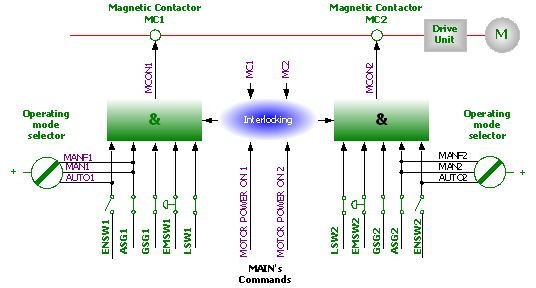

# 1.10.1. Operating a Safety Circuit

Figure 1.5 Configuration for safety chain

 

The robot's safety system is based on a two-channel safety circuit that is continuously monitored. If an error is detected, the power supply to the motors is disconnected and the motor brake is applied. To return the robot to MOTOR ON mode, the switches of two-channel circuit must be connected. If one of the two-channel circuit switches shorts, the contactor of motor will be disconnected leading to the application of brake, and finally the robot will be stopped. Furthermore, when safety circuit is disconnected, the interrupting call will be sent automatically to the controller to find out the possible reason for the interruption. 

The safety control circuit of operation is based on dual safety electric circuit in which the controller and MOTOR ON mode are operated interactively. In order to be in MOTOR ON mode, the safety circuit consisted of several switches must be all connected. MOTOR ON mode indicates that drive power is supplied to the motors. If one of the contactors is disconnected, the robot will always return to MOTOR OFF mode.

MOTOR OFF mode indicates that drive power is removed from the robot's motors and the brakes are applied. The status of the switches is displayed on the teach pendant. (Refer to the I/O monitoring screen of "SERVICE" menu, 『Operation manual』.)

<b>Safety circuit</b>

The emergency stop buttons on the controller panel and on the teach pendant and external emergency stop buttons are included in the safety circuit of operation. Users may install the safety devices (safety plug, safety stop device for safe place) which are operated in the AUTO mode. In a manual mode, the signals of these safety devices are ignored. You can connect the general safety stop devices that is active in all operating modes. No one can enter the working envelope in an automatic operation mode due to the unconditional operation of the safety devices (door, safety mat, safety plug etc.). These signals are also generated in a manual mode, but the controller will keep the robot operating while ignoring the robot's teaching. In this case, maximum speed of robot is restricted to 250mm/s. Thus, the purpose of this safety stop function is to secure the safe area around the manipulator while one approaches the robot for maintenance and teaching. 

When the robot is stopped with the limit switch, change the robot’s position by operating it with the pendant key at the constant setting mode. (Constant setting mode refers to the state of entry into the menu『[F2]: System』 menu)

<blockquote>
<table border="0">
    <thead>
        <tr>
            <td>
            

              
            

            </td> 
            <td colspan="4"> 
                The safety circuits must never be by-passed, modified or changed in any way.
            </td>
        </tr>
    </thead>
</table>  
</blockquote> 