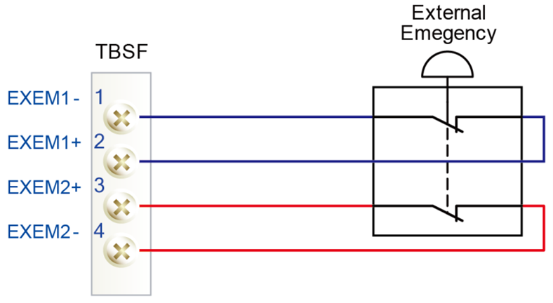

# 1.10.2. Emergency stop

An emergency stop should be activated when people or equipment is located at the dangerous area. The emergency stop buttons are located both on the control panel and on the teach pendant. 
All safety control devices such as emergency stop buttons on the control panel must be located outside the working envelope and easily accessible at any time.

 **Status of Emergency stop**  

When the button is pressed, the robot will operate as follows. 
Robot stops immediately in any cases.

<ol style="list-style-type:square" start="1">
		<li>
            Disconnect the servo system power.
        </li>		
		<li>
            Motor brake is activated.
        </li>	  
        <li>
        	Motor brake is activated.
        </li>
</ol>

For the emergency stop, the following two methods can operated simultaneously.

<ol style="list-style-type:decimal" start="1">
<li>
Emergency stop for control panel and teach pendant (Basic)  
Above the control and teach pendant console.
        </li> 
		<li>
Emergency stop of external system  
External emergency stop device (button etc.) can be connected to the safety electric circuit in accordance with applied standard for the emergency stop circuit.
(Please refer to system board in “basic configuration of controller”) At this time, the emergency stop must be connected to be “Normal On” and it must be check for proper operation during test run.
</li> 
</ol>

Figure 1.6 Connection with external emergency halt switch through system board terminal block TBEM