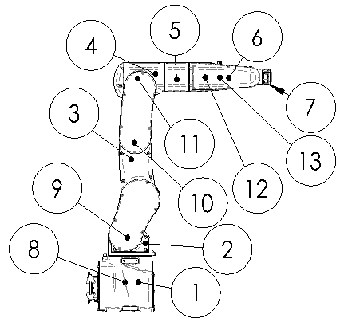

# 3.1. Robot Component Name

Name of each part of the main body is as shown in [Fig. 3.1], [Table 3-1] 

Figure 3.1 Name of Robot Components

 

<table class="tg">
<caption>Table 3-1 Name of Robot Components</caption>  
<thead>
  <tr>
    <th class="tg-bgl2">No.</th>
    <th class="tg-bgl2">Name of each part</th>
    <th class="tg-bgl2">No.</th>
    <th class="tg-bav5">Name of each part</th>
  </tr>
</thead>
<tbody>
  <tr>
    <td class="tg-baqh">1</td>
    <td class="tg-baqh">BASE BODY</td>
    <td class="tg-baqh">8</td>
    <td class="tg-baqh">S axis motor</td>
  </tr>
  <tr>
    <td class="tg-baqh">2</td>
    <td class="tg-baqh">LOWER FRAME</td>
    <td class="tg-baqh">9</td>
    <td class="tg-baqh">H axis motor</td>
  </tr>
  <tr>
    <td class="tg-baqh">3</td>
    <td class="tg-baqh">UPPER FRAME</td>
    <td class="tg-baqh">10</td>
    <td class="tg-baqh">V axis motor</td>
  </tr>
  <tr>
    <td class="tg-baqh">4</td>
    <td class="tg-baqh">ARM FRAME</td>
    <td class="tg-baqh">11</td>
    <td class="tg-baqh">R2 axis motor</td>
  </tr>
  <tr>
    <td class="tg-baqh">5</td>
    <td class="tg-baqh">ARM PIPE</td>
    <td class="tg-baqh">12</td>
    <td class="tg-baqh">B axis motor</td>
  </tr>
  <tr>
    <td class="tg-baqh">6</td>
    <td class="tg-baqh">WRIST BODY</td>
    <td class="tg-baqh">13</td>
    <td class="tg-baqh">R1 axis motor</td>
  </tr>
  <tr>
    <td class="tg-baqh">7</td>
    <td class="tg-baqh">WRIST HOLDER</td>
    <td class="tg-baqh"></td>
    <td class="tg-baqh"></td>
  </tr>
</tbody>
</table>
