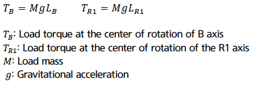

# 3.5.1. Permitted load torque, Permitted inertia moment estimation

The load, which will be applied to the mechanical interface of robot's wrist axis, is restricted by allowable weight, allowable load torque and allowable moment of inertia. The direction of coordinate system used to calculate the load torque and inertia moment is the same with the direction of robot base coordinate system.

*	Step 1

    Calculate the location of the weight center from the B axis rotation center (LX, LY, LZ)(LX, LY, LZ.)

    Lx: Location of weight center in X axis

    Ly: Location of weight center in Y axis

    Lz: Location of weight center in Z axis

*	Step 2

    Distance calculation from the axis B and R1 to the center of gravity.

    

    LB : Length from B axis rotation center to weight center

    LR1 : Length from R1 axis rotation center to weight center

*	Step 3

    계산된 거리로부터 부하 토크를 계산

    

*	Step 4

    Check if the load torque calculated in the step 3 is the same with or smaller than the limit value, on the basis of allowed load torque table.

 
* Note : If the load mass is similar to the mass on the torque curve below, the torque can be alternatively validated by checking if the distance calculated in the step 2 is distributed in the torque curve, instead of the step 3 and 4. If it is in the torque curve, the calculated load torque is smaller than the allowed load torque but if it is out of the torque curve, the calculated load torque is bigger than the allowed load torque.

  

 <b>Allowable load torque</b>

Table 3-2  Allowable load torque

<table class="tg">
<thead>
  <tr>
    <th class="tg-yhpm" rowspan="2">Robot model</th>
    <th class="tg-yhpm" colspan="3">Allowable load torque</th>
  </tr>
  <tr>
    <th class="tg-yhpm">R2 axis rotation</th>
    <th class="tg-yhpm">B axis rotation</th>
    <th class="tg-yhpm">R1 axis rotation</th>
  </tr>
</thead>
<tbody>
  <tr>
    <td class="tg-wa1i">HH4L</td>
    <td class="tg-nrix">6 Nm (0.61kgf·m) or less</td>
    <td class="tg-nrix">6 Nm (0.61kgf·m) or less</td>
    <td class="tg-nrix">3 Nm (0.30kgf·m) or less</td>
  </tr>
  <tr>
    <td class="tg-wa1i">HH7</td>
    <td class="tg-nrix" rowspan="3">17 Nm (1.73kgf·m) or less</td>
    <td class="tg-nrix" rowspan="3">17 Nm (1.73kgf·m) or less</td>
    <td class="tg-nrix" rowspan="3">10N·m (1.02kgf·m) or less</td>
  </tr>
  <tr>
    <td class="tg-wa1i">HH7E</td>
  </tr>
  <tr>
    <td class="tg-wa1i">HH8</td>
  </tr>
</tbody>
</table>

 <b>Allowable moment of inertia</b>

Table 3-3 Allowable moment of inertia

<table class="tg">
<thead>
  <tr>
    <th class="tg-yhpm" rowspan="2">Robot model</th>
    <th class="tg-yhpm" colspan="3">Allowable moment of inertia</th>
  </tr>
  <tr>
    <th class="tg-yhpm">R2 axis rotation</th>
    <th class="tg-yhpm">B axis rotation</th>
    <th class="tg-yhpm">R1 axis rotation</th>
  </tr>
</thead>
<tbody>
  <tr>
    <td class="tg-wa1i">HH4L</td>
    <td class="tg-nrix">0.12 kgm²</td>
    <td class="tg-nrix">0.12 kgm²</td>
    <td class="tg-nrix">0.03 kgm²</td>
  </tr>
  <tr>
    <td class="tg-wa1i">HH7</td>
    <td class="tg-nrix" rowspan="3">0.5 kgm²</td>
    <td class="tg-nrix" rowspan="3">0.5 kgm²</td>
    <td class="tg-nrix" rowspan="3">0.2 kgm²</td>
  </tr>
  <tr>
    <td class="tg-wa1i">HH7E</td>
  </tr>
  <tr>
    <td class="tg-wa1i">HH8</td>
  </tr>
</tbody>
</table>

Loads must be kept below maximum conditions shown in [Table 3-2] ~ [Table 3-3]

*	Step 1

    Calculate the inertia moment value of the load at each wrist axis center (Ja4, Ja5, Ja6)

    Ja4 - Inertia moment from R2 axis rotation center

    Ja5 - Inertia moment from B axis rotation center

    Ja6 - Inertia moment from R1 axis rotation center

*	Step 2

    Check if the inertia moment is under the thread according to the permissible inertia moment table