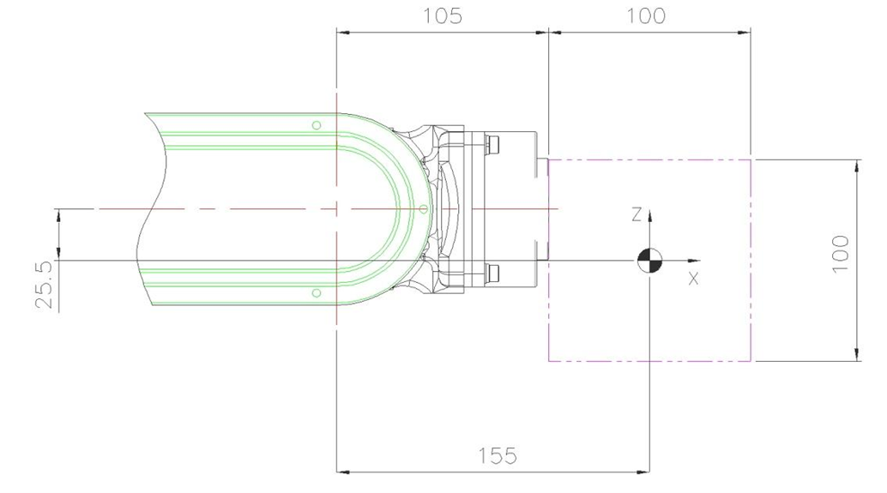
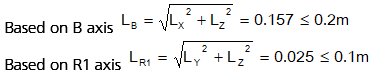
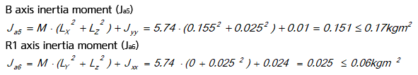

# 3.5.2. Example of permitted torque and inertia moment calculation (HA006B Case)

[Figure 3.7, 3.8] shows the possible range of where the material point can be located when it is considered that the load to be attached is in the material point. However, since the actual load (End Effector) does not almost always exist at the material point, evaluate the moment of inertia of each axis. For example, when considering the load to be attached as the material point,

<b>(Example) The robot type is [HA006B] and the load weight is 5.74kg</b>

 

Figure 3.8 2-D load model

 

M - Load weight

Jxx - Inertia moment in X direction from weight center of load

Jyy - Inertia moment in Y direction from weight center of load

Jzz - Inertia moment in Z direction from weight center of load

Ja4 - Inertia moment from R2 axis rotation center

Ja5 - Inertia moment from B axis rotation center

Ja6 - Inertia moment from R1 axis rotation center

 
  
☞ Load condition: Aluminum block (Mass 5.74kg) with a width of 100mm, a length of 100mm and a thickness of 200mm

①	Permitted torque limit

B-axis center of gravity position  LX = 155mm, LY = 0mm, LZ = -25.5mm

Apply the B and R1 axis distance limits in the torque map as shown below.	

②	Permitted inertia moment limit

Inertia moment of load from the weight Jxx=0.024kgm2, Jyy=0.01kgm2, Jzz=0.024kgm2

 
③	Conclusion : It is safe because the weight, torque and inertia moment all satisfy the limited condition.

 

*	Permissible center position from the center of R1 axis

    ①	Permissible center position when viewed from the permissible torque

    LR1 ≤ (Allowable torque) / (Load weight)

    LR1 = 5.9 N·m / (5.74Kg×9.8 m/s2) = 0.104 m

    ②	Permissible center position when viewed from the permissible moment of inertia

    LR1 ≤ (Permitted inertia moment / Load weight)1/2

    = (0.06 kg·m2 / 5.74kg)1/2 = 0.102 m

    These results is restricted by the distance allowed torque in the shaft center in R1 it is within the 0.102 m.

 

*	Permissible center position at the center of B axis

    (This robot is located on the same axis as the B axis, and the permissible load torque and allowable moment of inertia are the same for the B axis and R2 axis. Therefore, when the allowable condition of the B axis is satisfied, the allowable condition of the R2 axis is also satisfied..)

    ①	Permissible  center position when viewed from permissible torque

    LB ≤ (Allowable torque) / (Load weight)

    LB = 9.8 N·m / (5.74Kg×9.8 m/s2) = 0.174 m

    ②	Permissible center position when viewed from the permissible moment of inertia

    LB ≤ (Permitted inertia moment /Load weight)1/2 

    = (0.27 kg·m2 / 5.74kg)1/2 = 0.217 m

    These results are regulated by the distance allowed torque on the B axis in, it will be within 0.174m.

 

* <b>Torque Map</b>

Figure 3.9 Wrist axis Torque lead : (HH4L)                               

Figure 3.10 Wrist axis Torque lead : (HH7)

Figure 3.11 Wrist axis Torque lead : (HH8)

Figure 3.12 Wrist axis Torque lead : (HH7E)
 
