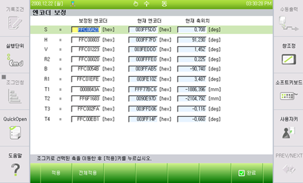

# 6.4.3. Encoder offset and Selection

*	It is necessary to compensate encoder data for the basic position of each axis.
*	Refer to 『Encoder offset』in the Controller Manual for details.

<b>[Encoder offset Screen]</b>

(1)	Select the axis, move the axis to a standard position using the [Axis operation] key, and press the 『[F1]: Apply』key. 

(2)	Place the robot’s entire axis as the standard position using the [Axis operation] key and press the 『[F2]: Apply all』 key to carry out encoder offset correction for the entire axis.

(3)	To save the set data, press the 『[F7]: Complete』 key. The [ESC] key will prevent the changes being saved.

<table>
<thead>
  <tr>
    <td>
    

      
    

    </td>
    <td colspan="4"><b>Warning</b> 
    In case of encoder DATA compensation after replacing motor, check if the motor power is on with the power 『ON』.</td>
  </tr>
</thead>
</table>  

