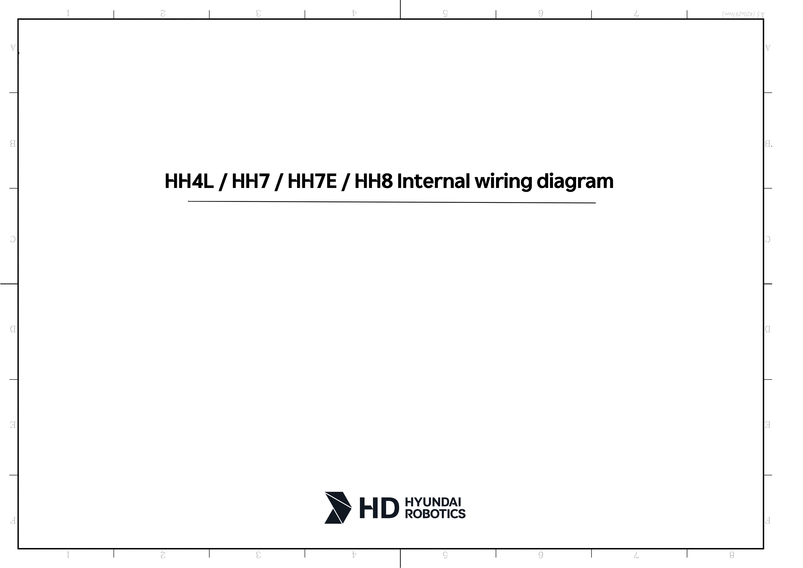

# 8.1. Parts Placement Drawing 

Internal wiring is shown in a connection diagram per unit, and thus utilize it to inspect and replace the wiring.

Figure 8.1 Placement of Parts in the Manipulator  

